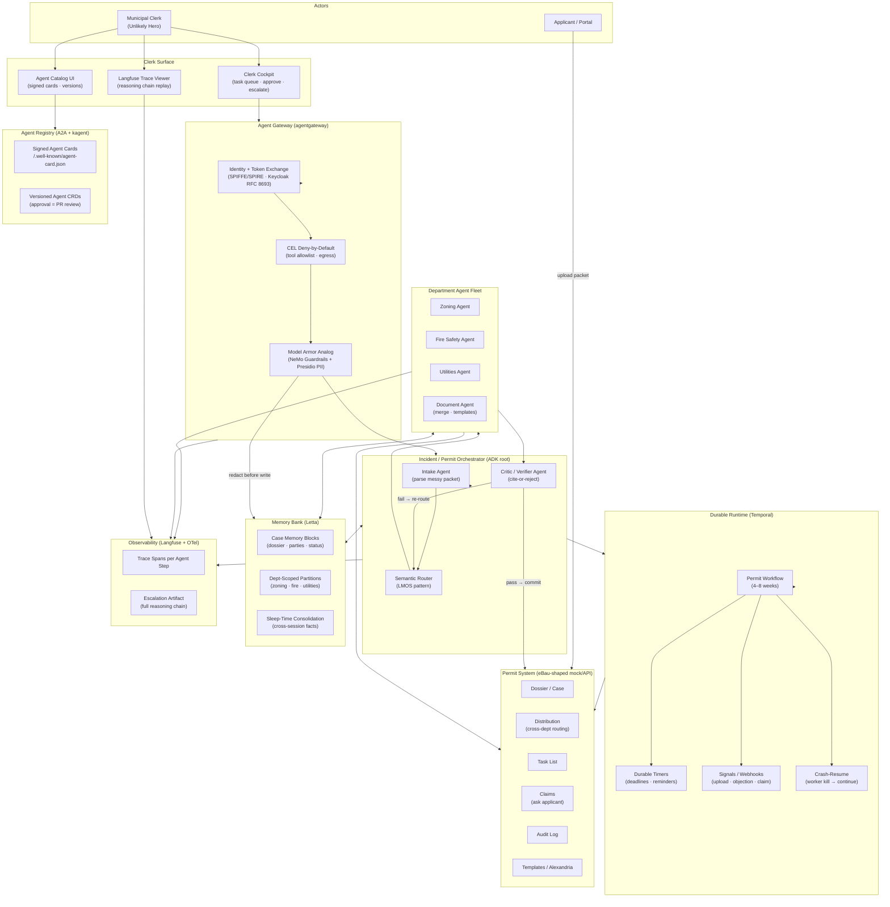
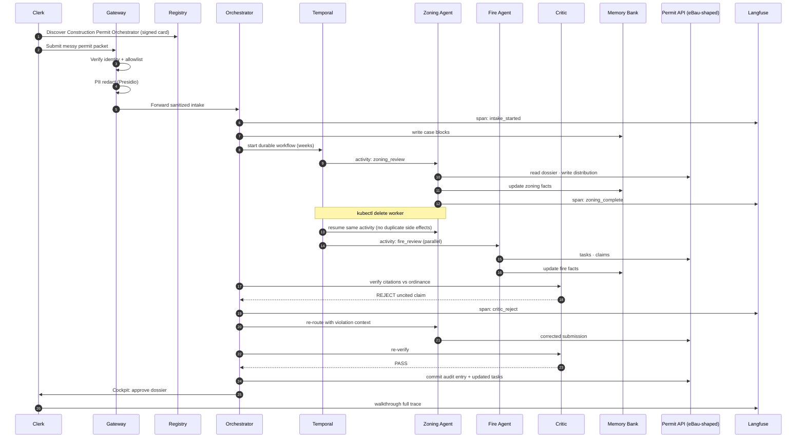
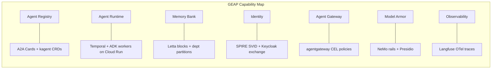
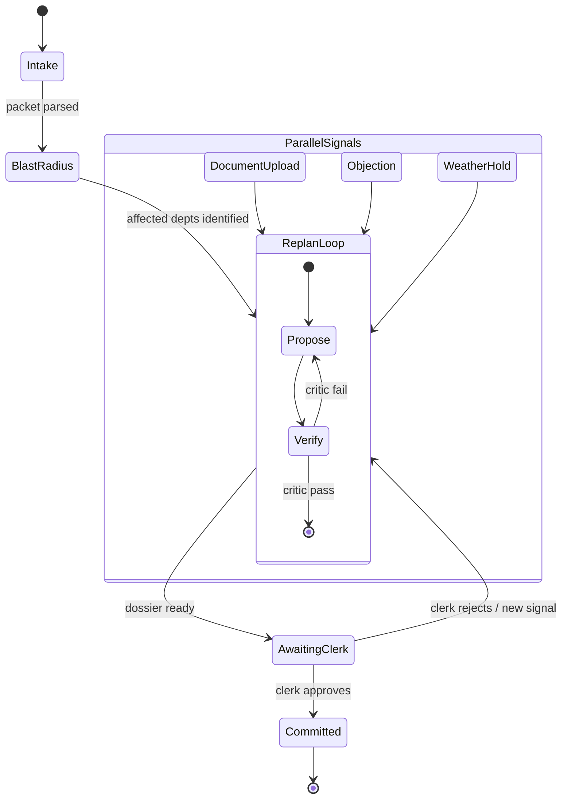

# Permit Pilot — Complete Plan

> All Things Agentic Hackathon — [allthingsagentichackathon.devpost.com](https://allthingsagentichackathon.devpost.com/)
> Compiled from chat (Claude Fable 5 research + architecture + NYC verification), Aug 2026.

---

# Part 1 — Track Lock & Build Brief (15 Aug 2026 research pass)

**Pick Fortified Enterprise Fleet.** It is the least-crowded track, the category prize is the same $20,000 as the other two, and the closest analog shows the Grand Prize coming from the starved category. The full breakdown is in [all-things-agentic-track](/home/sati/.cursor/projects/home-sati-Desktop/canvases/all-things-agentic-track.canvas.tsx) — a live canvas you can keep open beside the chat.

This event’s gallery is still unpublished, so there are no live per-track counts. Crowding was measured from four comparable Devpost events plus a full scrape of the 2025 [ADK Hackathon](https://googlecloudmultiagents.devpost.com/) (same sponsor, same admin, 476 public submissions).

| Event | Crowded bucket | Starved bucket | Outcome |
|---|---|---|---|
| ADK 2025 | Automation 187 (39%) | Customer service 81 (17%) | Grand Prize from the starved bucket |
| Cloud Run 2025 | AI Studio 52% | GPUs 5.4% | Equal prizes; infra scared people off |
| AI in Action 2025 | MongoDB 70% | GitLab 30% | GitLab had ~2.3× better odds |
| This event (est. 200–450) | Taskmaster ~45–55% | **Fleet ~15–20%** | Inference from the rows above |

A keyword scrape of all 476 ADK blurbs found only **11 (2.3%)** that mentioned compliance, governance, audit, guardrails, or observability. This event’s forum also concentrates hesitation on Fleet. Collaborative Partner is the second-least crowded, but its official examples already have a near-blueprint in DeepTutor — high me-too risk.

---

### Constraints that DQ otherwise-strong builds

Stage One is pass/fail. Judges may never run your code. The 4-minute video carries the score.

- **New work only** during 3–31 Aug. Frameworks are fine; disclose other pre-existing code.
- **Mandatory later:** Gemini 3.5+, one of ADK / GenAI SDK / Antigravity / Genkit, one GCP service. Not needed for inspiration now.
- **One track, one prize.** Sponsor can reassign.
- **GEAP is recommended, not required** — but FAQ says those named subsystems are what Fleet judging is built around. Forum questions on first-party equivalents are unanswered. Implement the capability; prefer named services if time allows.
- **Unedited live demo ≤4 min**, public YouTube/Vimeo, English, **visible GCP proof** (Console / Cloud Run / Vertex / `.run` URL). Speed-up of a continuous take is unanswered — plan a 1× path that fits.
- **Fleet scoring twist:** multi-agent delegation plus an **Unlikely Hero** outside corporate roles (nurse, clerk, NGO coordinator — not sales).
- **Bonus (Stage Three):** public build write-up +0.2 (must say it is for this hackathon); social post +0.2 with `#AllThingsAgenticHackathon`; Gemma / Veo / Lyria +0.2 each, cap +0.6.
- Italy, Quebec, and sanctioned countries are ineligible. Credits form closes 28 Aug 12:00 PT. After the deadline, no edits.

Judging: Innovation & Operational Utility 40% / Architectural Discipline 30% / Demo & Production Readiness 30%.

---

### Inspiration stack that covers every Fleet capability

Study these. Do not fork copyleft or source-available cores. Stars from GitHub API, 15 Aug 2026.

| Capability | Project | License | Why it maps |
|---|---|---|---|
| Fleet blueprint | [Eclipse LMOS](https://github.com/eclipse-lmos/lmos-runtime) | Apache-2.0 | Deutsche Telekom production PaaS: catalog, semantic routing, canary rollback. Copy the architecture, not the JVM stack. |
| Registry | [A2A Agent Cards](https://github.com/a2aproject/A2A) (25k) + [kagent](https://github.com/kagent-dev/kagent) CRDs | Apache-2.0 | Signed cards + GitOps approval. Linux Foundation v1.0 / CNCF sandbox. |
| Gateway + policy | [agentgateway](https://github.com/agentgateway/agentgateway) (4.3k) | Apache-2.0 | AAIF-hosted. Agents hold no secrets. CEL deny-by-default; unauthorized tools hidden from `tools/list`. |
| Weeks-long runtime | [Temporal](https://github.com/temporalio/temporal) (22k) | MIT | Kill the worker mid-run; it resumes. [DBOS](https://github.com/dbos-inc/dbos-transact-py) is the lighter Postgres-only swap. |
| Memory | [Letta](https://github.com/letta-ai/letta) (24k) | Apache-2.0 | Shared blocks + sleep-time consolidation. [Graphiti](https://github.com/getzep/graphiti) if you need bi-temporal fact invalidation. |
| Guardrails | [NeMo Guardrails](https://github.com/NVIDIA-NeMo/Guardrails) + [Presidio](https://github.com/data-privacy-stack/presidio) | Apache / MIT | Injection rails + `self check facts` + PII before memory write. |
| Observability | [Langfuse](https://github.com/langfuse/langfuse) (33k) | MIT core | OTel reasoning-chain replay. Pin GenAI semconv — still Development status. |
| Identity | [SPIFFE/SPIRE](https://github.com/spiffe/spire) + Keycloak | Apache-2.0 | SVID proves which agent; RFC 8693 proves on whose behalf. |

**Do not build on:** Suna (Elastic 2.0), Skyvern (AGPL), AutoGPT Platform (Polyform Shield), Inngest server (SSPL), n8n (fair-code), LLM Guard (archived). LiteLLM’s audit-log / full guardrail suite is enterprise-licensed — route compliance evidence through agentgateway, Presidio, and Langfuse.

Taskmaster and Collaborative research is complete if you later switch: Suna’s trigger DSL + Temporal (don’t fork Suna); DeepTutor’s L1→L2→L3 memory + Co-STORM’s mind map + Docling for messy ingestion.

---

### Build this: Permit Pilot

A municipal clerk — the Unlikely Hero — discovers a Construction Permit Orchestrator in a cross-department registry. Zoning, fire-safety, and utilities agents are published by different departments, each with its own identity and tool allowlist. A permit runs 4–8 weeks on durable timers and document-upload webhooks.

Unedited demo beats that map 1:1 to the rubric:

1. Clerk finds the agent via a signed A2A card (registry).
2. Drop a messy packet; PII redacted before memory (guardrails + data sovereignty).
3. Delete the zoning worker mid-run; Temporal resumes (weeks-long async).
4. Critic fails an uncited ordinance claim; re-route, then escalate with the Langfuse trace (hallucination recovery).
5. Unsigned rogue agent rejected at the gateway (identity).

Runner-ups if permitting is not yours: **Ward Steward** (hospital charge nurse, agency onboarding) or **Relief Chain** (NGO coordinator, per-country memory partitions).

What wins these events, from 15 comparable winners: a painful domain workflow end to end, a narratable multi-agent architecture, a tight live demo with GCP proof, and a reproducible repo. Polished generic assistants lose. Inbox→Jira→Slack clones will flood Taskmaster. Name the project like a human, not “NexusAI.”

---

# Part 2 — Final Decision Recap

Purani chats padh ke — **All Things Agentic Hackathon** ([allthingsagentichackathon.devpost.com](https://allthingsagentichackathon.devpost.com/)) ke liye yeh decide hua tha. **Actual code build abhi tak start nahi hua** — sirf research + strategy lock hui thi. (Aug 21 ko **CoverSet** banaya gaya tha, lekin woh **Agentic Cinema** hackathon ke liye tha, All Things Agentic ke liye nahi.)

---

## Final decision (15 Aug 2026 research pass)

### 1. Track: **Fortified Enterprise Fleet**
Baaki do tracks reject kiye:

| Track | Kyon reject |
|-------|-------------|
| **Taskmaster** | Sabse crowded (~45–55% submissions). Inbox → Jira → Slack clones expected. |
| **Collaborative Partner** | DeepTutor jaisa blueprint already hai — me-too risk. |
| **Fortified Enterprise Fleet** ✅ | Sabse kam crowded (~15–20%). Same $20k category prize. ADK 2025 mein Grand Prize bhi kam-crowded category se aaya. |

Logic: zyada teams Fleet se darte hain (7 subsystems — registry, runtime, memory, identity, gateway, guardrails, observability), isliye odds better.

---

### 2. Product: **"Permit Pilot"**

**One-liner:** Municipal clerk (Unlikely Hero) cross-department permit agents discover karta hai, messy permit packet drop karta hai, agents 4–8 weeks durable workflow chalate hain.

**Demo beats (4-min unedited video ke liye):**
1. Clerk catalog mein signed A2A agent card dhundhe
2. Messy permit packet drop → PII redact before memory
3. `kubectl delete` zoning worker mid-run → workflow resume
4. Critic agent uncited claim fail → re-route + escalate with full trace
5. Unsigned rogue agent gateway pe reject → Langfuse trace walkthrough

**Runner-up personas** (agar permitting pasand na ho):
- **Ward Steward** — hospital charge nurse, agency staff onboarding 3–6 weeks
- **Relief Chain** — NGO field coordinator, per-country memory partitions

---

### 3. Tech stack (inspiration — Gemini/ADK/GCP baad mein wire karna tha)

| Capability | OSS inspiration |
|------------|-----------------|
| Fleet blueprint | Eclipse LMOS |
| Registry | A2A Agent Cards + kagent |
| Gateway + policy | agentgateway |
| Weeks-long runtime | Temporal (ya DBOS) |
| Memory bank | Letta (ya Graphiti) |
| Guardrails | NeMo Guardrails + Presidio |
| Observability | Langfuse |
| Identity | SPIFFE/SPIRE + Keycloak |

**Fork candidates** (Fleet infra ke liye): Reef (TechEx winner), Reflex/Agents-of-SigNoz, kassi, MCP-Security-Governance.

**Avoid:** Suna (Elastic 2.0), Skyvern (AGPL), AutoGPT (Polyform), n8n (fair-code).

---

### 4. Domain reference (20 Aug follow-up)

[inosca/ebau](https://github.com/inosca/ebau) — Swiss cantons ka real production permit system.

**Decision:** eBau **submit nahi karna**. Sirf **domain/workflow reference** — agents uske upar baithte hain:

```
Applicant upload → [Your agent fleet: ADK + GCP]
  Zoning │ Fire │ Utilities │ Critic │ Gateway │ Langfuse
        → eBau-shaped mock/API → Clerk approves
```

Complements: `permit_os`, `Portarium`, `permitflowAI`.

---

## Kya explicitly reject hua

- Taskmaster mein generic workflow agent
- Collaborative Partner mein tutoring/design partner clone
- eBau ko directly fork karke "Gemini add karo"
- Prebuilt OSS ko as-is submit karna (rules: enhance karna padta hai)

---

## Mandatory stack (baad mein wire karna tha)

- Gemini 3.5+ (API ya Vertex)
- ADK / GenAI SDK / Genkit
- Ek GCP service (Cloud Run, Firestore, Pub/Sub, etc.)
- ≤4 min unedited demo video with GCP proof
- Deadline: **31 Aug 2026, 5:00 PM PT**

---

## Current status

| Item | Status |
|------|--------|
| Track lock (Fleet) | ✅ Decided |
| Product concept (Permit Pilot) | ✅ Decided |
| Research canvas | ✅ Saved |
| Actual repo/build | ❌ Not started |
| CoverSet (film scheduling) | ✅ Built — **different hackathon** |

---

**Bottom line:** All Things Agentic ke liye **Fortified Enterprise Fleet track + Permit Pilot** (municipal clerk + multi-agent permit orchestration + GEAP-style fleet stack) lock hua tha. Build abhi pending hai.

Agar chaho to next step mein Permit Pilot ka folder structure + ADK pipeline scaffold kar sakte hain.

---

# Part 3 — Architecture Design









---

# Part 4 — Country Lock: United States — New York City

## Country lock: **United States — New York City**

Purani chats mein **Permit Pilot** generic municipal clerk ke liye tha. Free public APIs + realistic multi-department fleet ke liye **NYC sabse strong match** hai — live verify bhi ho chuka hai.

---

## Kyon NYC (scoring)

| Criterion | NYC | UK (England) | Finland | Switzerland | Australia |
|-----------|-----|--------------|---------|-------------|-----------|
| Free permit API | ✅ Socrata, no key | ✅ planning.data.gov.uk | ✅ Ryhti OGC | ❌ eBau closed | ⚠️ ABS stats only |
| Live permit records | ✅ ~967k rows | ✅ ~100k apps | ✅ national register | ❌ | ❌ individual permits |
| Cross-dept agents (zoning/fire/utilities) | ✅ DOB, FDNY, DEP, LPC, HPD | ⚠️ planning-focused | ⚠️ GIS-heavy | ✅ prod but closed | ❌ |
| Property join key (BBL/BIN) | ✅ across datasets | ✅ UPRN | ✅ property ID | — | — |
| Constraint data (zoning, landmarks, flood) | ✅ PLUTO + more | ✅ 40+ datasets | ⚠️ limited | — | — |
| English demo | ✅ | ✅ | ⚠️ codelists Finnish | multi | ✅ |
| Clerk persona realism | ✅ DOB plan examiner | ✅ planning officer | building inspector | canton clerk | — |
| Daily updates | ✅ | ✅ | ✅ | — | quarterly stats |

**Verdict:** UK second-best (national API clean hai, lekin planning ≠ building permit workflow). Finland semantic match achha hai (national Ryhti) lekin APIs GIS-centric hain, workflow detail kam. Switzerland mein eBau production hai par **free public API nahi**. Australia mein sirf aggregate building approvals, individual permit records nahi.

---

## NYC → Permit Pilot agent mapping (real APIs)

```
Clerk persona: NYC DOB Plan Examiner / Project Manager
Join keys:     BIN + BBL (har agent same property pe converge kare)
```

| Agent | Real NYC source | API |
|-------|-----------------|-----|
| **Zoning Agent** | DCP PLUTO — zoning district, FAR, land use, historic district | `64uk-42ks` |
| **Building/DOB Agent** | DOB NOW permits + filings | `rbx6-tga4` (+ legacy `ipu4-2q9a`) |
| **Fire Agent** | FDNY violations / inspections | `avgm-ztsb` |
| **Utilities Agent** | DEP water/sewer ECB violations | `skr7-cxt3` |
| **Landmarks Agent** | LPC landmark + historic district checks | PLUTO `landmark`/`histdist` + LPC datasets |
| **Housing Agent** | HPD violations (multi-family) | HPD datasets via Socrata |
| **Critic/Verifier** | Cross-check permit vs PLUTO zoning + violation history | deterministic joins on BBL |
| **Sentinel** | Open-Meteo (free, global) + exterior permit days | already in PRD |

**Live verified (Aug 21, 2026):**
- `rbx6-tga4` → HTTP 200, real permit JSON
- `64uk-42ks` (PLUTO) → HTTP 200
- `skr7-cxt3` (DEP) → HTTP 200
- UK `planning.data.gov.uk` → HTTP 200, 100k+ entities
- Finland Ryhti → HTTP 200, OGC Features

**Base URL pattern:**
```
https://data.cityofnewyork.us/resource/{dataset-id}.json?$where=bbl='4051980021'&$limit=50
```

---

## Realistic demo scenarios (NYC data se)

1. **Queens demolition permit** (`rbx6-tga4` live row) — BIN `4117367`, BBL `4051980021`, "Demolition of 3 story building" → zoning + FDNY + DEP agents parallel review
2. **Landmark district conflict** — PLUTO `histdist` populated → Landmarks agent blocks, critic cites district
3. **Incomplete filing** — permit status "not yet issued" → clerk intake → multi-week Temporal workflow
4. **DEP violation on same BBL** — Utilities agent flags open ECB violation before approval

---

## Project rebrand

| Old (generic) | New (NYC-realistic) |
|---------------|---------------------|
| Northfield fictional production | **Live NYC permit case** seeded from Socrata |
| 7 fictional locations | Real addresses + BBL/BIN |
| Fictional cast | Real applicant/owner fields from DOB data |
| Generic ordinance citations | NYC Zoning Resolution + DOB work types |

Hackathon video: *"When a Queens demolition permit hits a DEP violation and landmark check at 6 PM, agents re-plan the review queue by 6:04."*

---

## Loop status

- **First pass:** country comparison + live API verification — done
- **Heartbeat:** 30 min interval, next tick remaining NYC datasets (DOB violations, landmarks, 311, filings) verify karega
- Agar koi naya free API mile ya evidence change ho, recommendation update hogi

---

**Next build step (jab bolo):** NYC Socrata adapter layer — `BBL`/`BIN` join, PLUTO constraint engine, aur real seed cases `coverset`/Permit Pilot backend mein wire karna.

---

# Part 5 — Verified APIs (Live Tested, Aug 21 2026)

Live test complete — **21/22 NYC datasets working**. Sudo ki zaroorat nahi padi (sirf public HTTPS APIs).

---

## Final score

| Phase | Result |
|-------|--------|
| Dataset reachability | **21/22 OK** |
| Cross-dataset joins | **7/12** (0 rows ≠ broken API — demo property pe data nahi hai) |
| Record counts | Verified |
| External (Open-Meteo, Socrata catalog) | OK |
| End-to-end demo case | **Assembles from live APIs** |

Full JSON: `/tmp/nyc_api_test_v2.json`

---

## Working datasets (verified live)

| Agent | Dataset ID | Records | Latency |
|-------|-----------|---------|---------|
| **DOB / Building** | `rbx6-tga4` | **987,585** permits | ~1.3s |
| **Filings** | `w9ak-ipjd` | **946,103** filings | ~1.3s |
| **Zoning** | `64uk-42ks` | **858,602** PLUTO lots | ~1.2s |
| **DOB Violations** | `3h2n-5cm9` | live | ~1.1s |
| **DOB ECB** | `6bgk-3dad` | live | ~1.4s |
| **DOB Safety** | `855j-jady` | live | ~1.7s |
| **DEP / Utilities** | `skr7-cxt3` | live | ~2.4s |
| **HPD / Housing** | `wvxf-dwi5` | live | ~1.2s |
| **HPD Complaints** | `ygpa-z7cr` | live | ~1.1s |
| **Landmarks** | `gpmc-yuvp`, `buis-pvji`, `ncre-qhxs`, `skyk-mpzq` | live | ~1.4s |
| **LPC Permits** | `dpm2-m9mq` | live | ~1.4s |
| **BSA Appeals** | `yvxd-uipr` | live | ~1.7s |
| **Property (ACRIS)** | `bnx9-e6tj`, `636b-3b5g` | live (slow ~8–21s) | OK |
| **311 Ops** | `erm2-nwe9` | **22.2M** requests | ~1.6s |
| **FDNY (fallback)** | `bi53-yph3` | historical violations | ~1.4s |
| **Sentinel weather** | Open-Meteo | 7-day forecast | ~0.8s |

---

## Only failure

| Dataset | Issue | Fix |
|---------|-------|-----|
| `avgm-ztsb` (FDNY Violations live) | **Timeout** after 45s | Use `bi53-yph3` instead — verified OK |

---

## Live demo case (Queens, BIN `4117367`)

Real data, abhi fetch hua:

```
Address:  43-30 PARSONS BOULEVARD, QUEENS
BIN/BBL:  4117367 / 4051980021
Work:     Construction Fence — Demolition of 3 story building
Status:   Signed-off
Zoning:   R4  |  LandUse=11  |  No historic district
Owner:    FLUSHING HOSPITAL MEDICAL CENTER
```

**Joins on this property:**
- PLUTO by BBL → 1 row
- Permits by BBL/BIN → 7 rows
- Filings by BIN → 5 rows
- 311 by BBL → 3 rows
- DOB violations by BIN → **56 rows** (building has violation history)
- DEP by Queens street → 3 rows (borough-level)
- Landmarks/LPC on this BBL → 0 (expected — not landmarked)

---

## Corrected dataset IDs (pehle galat the)

| Wrong ID | Correct ID | Name |
|----------|-----------|------|
| `9ak-ipjd` | **`w9ak-ipjd`** | DOB NOW Filings |
| `wv34-9d67` | **`wvxf-dwi5`** | HPD Violations |
| `p843-mcju` | **`buis-pvji`** / **`gpmc-yuvp`** | Landmarks |
| `7w4b-tj9d` | **`yvxd-uipr`** | BSA Applications |
| `wvxf-dwi5` as DOB | **`3h2n-5cm9`** | DOB Violations |

---

## Join keys (implementation ke liye)

| Dataset | Join field |
|---------|-----------|
| Permits, PLUTO, 311 | `bbl`, `bin` |
| DOB Violations | `bin` or `block`+`lot`+`boro` |
| HPD Violations | `bin` |
| DEP | `violation_location_street_name` + borough (no BBL) |
| ACRIS | `recorded_borough` + document IDs (block/lot nahi) |

---

**Bottom line:** NYC Permit Pilot ke liye **production-grade free public API stack ready hai**. Sirf FDNY live dataset slow hai — `bi53-yph3` use karo. Agla step: in IDs ko backend adapter mein wire karna.

---

## Expanded scan (Aug 21, 2026 — live tested)

| Phase | Result |
|-------|--------|
| Catalog datasets discovered | **323** |
| Relevant tested | **229** |
| Reachable OK | **209 (91%)** |
| Production-grade APIs documented | **~80** |

Full JSON: `/tmp/nyc_api_full_registry.json`

---

## Expanded Agent → API Mapping (Tier 2 additions, all live-tested)

- **Zoning:** `fdkv-4t4z`, `2iga-a6mk`, `4j6i-9rmr` (ULURP)
- **Elevator:** `e5aq-a4j2`, `kfp4-dz4h` (2 devices on demo BIN)
- **Facades:** `xubg-57si`
- **COO:** `pkdm-hqz6`
- **Electrical:** `dm9a-ab7w`
- **Landmarks:** `gpmc-yuvp`, `wycc-5aqt`, `dpm2-m9mq`
- **BSA/Appeals:** `yvxd-uipr`, `f72e-3i4c`
- **Environmental/Sentinel:** Open-Meteo, `epne-qv9x`, `27ya-gqtm`, `5xsi-dfpx`, `3279-pp7v`, `jqfp-uff7`
- **DOT/Street:** `9fnm-j6if`, `478a-yykk`, `tqtj-sjs8`
- **Complaints:** `eabe-havv` (5 rows on demo BIN)

Demo BIN `4117367` richness: 7 permits, 6 historical, 56 DOB violations, 6 ECB violations, 5 complaints, 2 elevators, 3×311, PLUTO R4.

---

## Known Failures & Workarounds

| Dataset | Issue | Use instead |
|---------|-------|-------------|
| `avgm-ztsb` | FDNY live — timeout | `bi53-yph3` |
| `pkdm-hqsa` | Stop Work — 404 retired | `eabe-havv` (DOB complaints) + `6bgk-3dad` |
| `jz4z-kudi` | OATH hearings — timeout | `y3hw-z6bm` |
| `k55i-dnjd` | Dev Pipeline — 404 | `8586-3zfm` + `br6q-ssj3` |

---

## Base URL pattern (use karne ke liye)

```
https://data.cityofnewyork.us/resource/{dataset-id}.json?$where=bbl='4051980021'&$limit=50
```

**Open-Meteo (Sentinel weather):**
```
https://api.open-meteo.com/v1/forecast?latitude=40.756514&longitude=-73.817023&daily=precipitation_sum&timezone=America/New_York&forecast_days=7
```

**Socrata catalog search:**
```
https://api.us.socrata.com/api/catalog/v1?domains=data.cityofnewyork.us&q=building%20permits&only=datasets&limit=15
```

