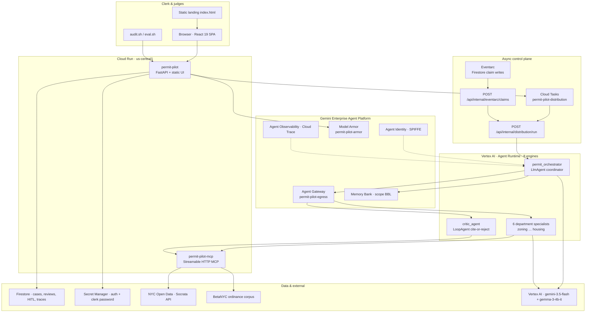
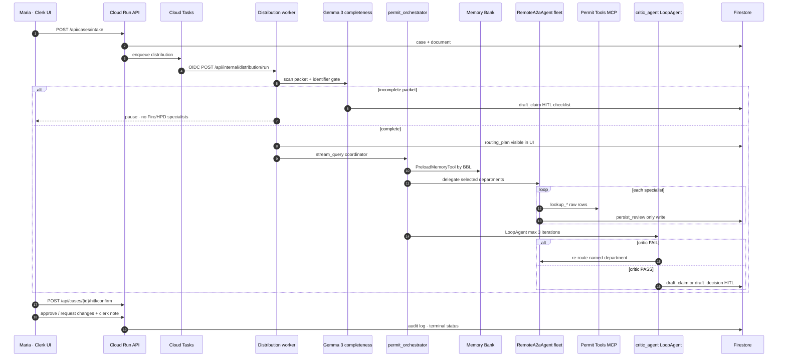
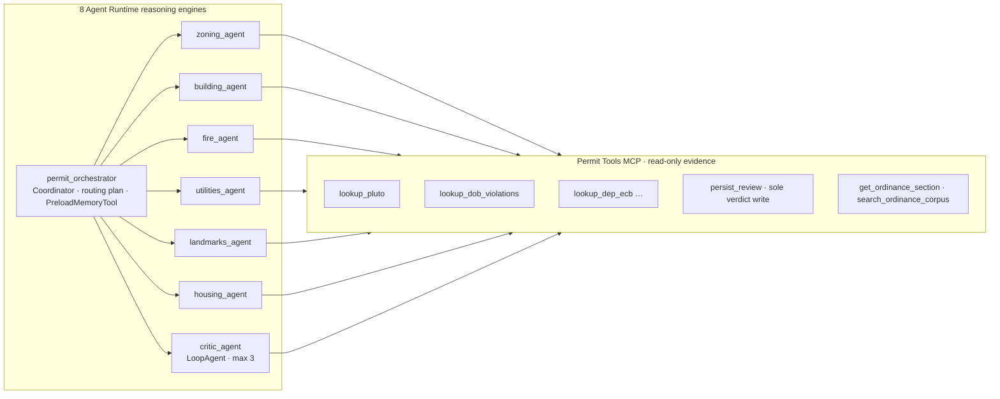
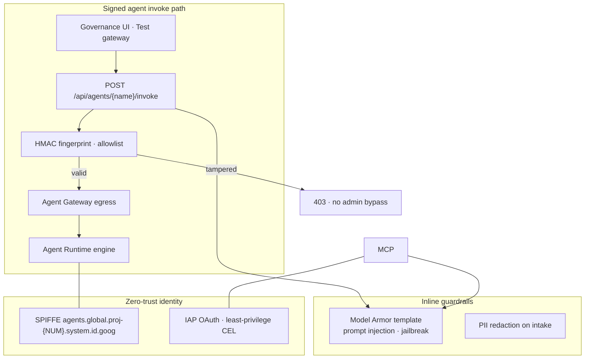

# Permit Pilot

[](https://allthingsagentichackathon.devpost.com/)
[](https://allthingsagentichackathon.devpost.com/)
[](https://cloud.google.com/vertex-ai)
[](https://google.github.io/adk-docs/)
[](https://permit-pilot-pbrfw2zkaq-uc.a.run.app/)

**NYC building-permit clerk orchestration** on the Gemini Enterprise Agent Platform. A coordinator writes a routing plan, delegates to sister-agency specialists over A2A, and pauses for a human clerk. Agents never approve a permit and never notify the applicant.

Built for the [All Things Agentic Hackathon](https://allthingsagentichackathon.devpost.com/) — **Fortified Enterprise Fleet** track · `#AllThingsAgenticHackathon`

Maria is a Queens plan examiner. Packets land incomplete, sister agencies are not in her inbox, and DOB NOW does not draft the first-review objection sheet. Permit Pilot is the clerk layer **above DOB NOW** — it does not replace it.

**Honest capability bound:** packet text + optional PDF + live NYC Open Data + ordinance corpus. It does not measure CAD, egress, or drawings.

| Live service | URL |
|--------------|-----|
| **Clerk app** (React UI + FastAPI `/api`) | https://permit-pilot-pbrfw2zkaq-uc.a.run.app |
| **Permit Tools MCP** (authenticated Streamable HTTP) | https://permit-pilot-mcp-pbrfw2zkaq-uc.a.run.app/mcp |
| **Landing** (public marketing) | https://permit-pilot-pbrfw2zkaq-uc.a.run.app/ |

**GCP project:** `gen-lang-client-0233250350` · **Region:** `us-central1` · **Model:** `gemini-3.5-flash` at `VERTEX_LOCATION=global`

---

## Table of contents

- [Hackathon submission](#hackathon-submission)
- [Architecture](#architecture)
- [Fortified Enterprise Fleet compliance](#fortified-enterprise-fleet-compliance)
- [What Maria sees](#what-maria-sees)
- [Technologies used](#technologies-used)
- [Data sources](#data-sources)
- [Repo layout](#repo-layout)
- [Quick start (local)](#quick-start-local)
- [Deploy (Cloud Run + Agent Runtime)](#deploy-cloud-run--agent-runtime)
- [API highlights](#api-highlights)
- [Demo video](#demo-video)
- [Evaluation](#evaluation)
- [Findings and learnings](#findings-and-learnings)
- [License](#license)

---

## Hackathon submission

Copy-paste fields for [Devpost](https://allthingsagentichackathon.devpost.com/):

| Field | Value |
|-------|-------|
| **Hosted project URL** | https://permit-pilot-pbrfw2zkaq-uc.a.run.app |
| **Track** | Fortified Enterprise Fleet |
| **Hashtag** | `#AllThingsAgenticHackathon` |
| **Demo video** | _Add your ~4 min YouTube/Loom URL here before submit_ |
| **Code repository** | _Add your GitHub URL; if private, share with `testing@devpost.com` and `cloudhackathons@google.com`_ |

**Elevator pitch (text description):** Permit Pilot gives NYC plan examiners a clerk workspace above DOB NOW: intake from PLUTO, async multi-agent distribution over live NYC Open Data, numbered objection sheets with ordinance citations, and human-in-the-loop confirmation before anything goes to the applicant. Eight ADK agents on Vertex Agent Runtime coordinate over A2A; a critic loop and Model Armor guardrails keep verdicts evidence-backed.

**Features and functionality**

- Clerk inbox with 5-day review clock, case search, and five-tab case file (Overview, Review, Packet, Applicant, History)
- Intelligent routing plan (e.g. plumbing + empty `histdist` skips Landmarks)
- Gemma 3 packet completeness gate → checklist claim when identifiers missing
- Six department specialists + critic over MCP raw Socrata evidence
- HITL `draft_claim` / `draft_decision` — Maria confirms; tool never emails applicant
- Crash/resume distribution; Eventarc resumes when applicant replies weeks later
- Agent Gateway egress, SPIFFE identity, invoke fingerprint allowlist, Memory Bank by BBL

**Spin-up proof:** `./scripts/audit.sh` against live Cloud Run (see [Deploy](#deploy-cloud-run--agent-runtime)). Demo video must show `.run.app` URL and/or Cloud Console.

---

## Architecture

### 1. System context — layers on Google Cloud



### 2. Intake → distribution → clerk decision (hot path)



**Fallback chain (documented, never silent):** orchestrator A2A → parallel in-process department engines → `DistributionEngine` with `generated_by=engine_fallback` (evidence only, `needs_info`, never auto-FAIL sheet).

### 3. Agent fleet topology



| Engine | Role | MCP tools (subset) |
|--------|------|---------------------|
| `permit_orchestrator` | Writes routing plan; delegates via `RemoteA2aAgent` | — |
| `zoning_agent` | PLUTO district / land use | `lookup_pluto`, `persist_review` |
| `building_agent` | DOB permits + violations (read descriptions) | `lookup_dob_*`, ordinance, `persist_review` |
| `fire_agent` | FDNY by BIN | `lookup_fdny_violations`, `persist_review` |
| `utilities_agent` | DEP ECB at address | `lookup_dep_ecb`, `persist_review` |
| `landmarks_agent` | LPC district | `lookup_landmarks`, `persist_review` |
| `housing_agent` | HPD open classes | `lookup_hpd_violations`, `persist_review` |
| `critic_agent` | Cite-or-reject; reroute on FAIL | `validate_citations`, ordinance search |

### 4. Security, identity, and governance



### 5. Async & long-running operations

| Trigger | Mechanism | Handler |
|---------|-----------|---------|
| Intake, refresh, fleet run | Cloud Tasks → OIDC | `/api/internal/distribution/run` |
| Applicant claim response | Eventarc on Firestore | `/api/internal/eventarc/claims` |
| Clerk interrupt/resume | Authenticated API flag | Checked before each A2A hop |
| Memory across weeks | Memory Bank `{bbl}` + `PreloadMemoryTool` | Coordinator preload |

**Policy (consistent everywhere):** MCP `lookup_*` returns raw Socrata rows. `persist_review` is the only specialist verdict write. Violation **counts** are parcel context, not automatic FAIL. The critic rejects uncited FAILs, uncited objections, PASS without evidence, and unknown codes.

---

## Fortified Enterprise Fleet compliance

| GEAP capability | Permit Pilot implementation | Where to verify |
|-----------------|----------------------------|-----------------|
| **Agent Registry / catalog** | `GET /api/agents` fleet cards + department metadata | More → Departments |
| **Agent Runtime** | 8 reasoning engines deployed via `scripts/deploy-fleet.py` | `audit.sh` step 5 |
| **Memory Bank** | Scoped facts by BBL; coordinator `PreloadMemoryTool` | More → Property notes; `GET /api/memory/{bbl}` |
| **Agent Identity** | SPIFFE on every engine | Fleet cards in UI |
| **Agent Gateway** | `permit-pilot-egress`; engines rebound via `bind-agent-gateway.py` | More → Security |
| **Model Armor** | `permit-pilot-armor` on intake + governance inspect | `audit.sh` step 7 |
| **Agent Observability** | OpenTelemetry → Cloud Trace; in-app Traces | More → Technical history |
| **Enterprise async** | Cloud Tasks + Eventarc; weeks-later claim resume | History → technical record |
| **Compliance** | HITL before applicant-facing actions; no auto-approval; no outbound email | Review tab |

**Bonus integrations:** Gemma 3 (`gemma-3-4b-it`) for packet completeness scanning.

---

## What Maria sees

1. **My work** — daily inbox with 5-day review clock (home after sign-in)
2. **Find a case** — search by address, BBL, BIN, owner, or status
3. **Case file** — Overview, **Review** (completeness checklist or numbered objection sheet), Packet, Applicant, History
4. **More** — Departments, Security, Property notes, Technical history (judge / deep-link surfaces)

**Sign-in:** Google Sign-In (GIS) is primary on production. Collapsed **demo clerk account** (`maria`) remains for judging and `scripts/audit.sh`.

Agents never send email. Maria copies a confirmed request into DOB NOW.

### Reference cases (seeded)

| Address | BBL | Notes |
|---------|-----|--------|
| 43-30 Parsons Boulevard, Queens | `4051980021` | Demolition; specialists reason over DOB safety-violation **descriptions** |
| 112-08 178 Street, Queens | `4103000034` | BIN left empty — completeness checklist, not objections. Do not auto-fill BIN. |
| 761 Macon Street, Brooklyn | `3014930048` | Plumbing, PLUTO **R5B**, empty `histdist` — Landmarks not needed |

---

## Technologies used

| Layer | Stack |
|-------|--------|
| **LLM** | Vertex AI `gemini-3.5-flash` (global); Gemma 3 `gemma-3-4b-it` completeness |
| **Agent framework** | Google ADK — `LlmAgent`, `RemoteA2aAgent`, `LoopAgent`, `PreloadMemoryTool` |
| **Control plane** | Python 3.12 · FastAPI · Pydantic · `permit_pilot_core` shared package |
| **Frontend** | React 19 · Vite 6 · Tailwind 4 · TanStack Query |
| **MCP** | Streamable HTTP MCP server · raw NYC Open Data tools |
| **Data** | Firestore · Secret Manager |
| **Compute** | Cloud Run (UI+API, MCP) · Cloud Tasks · Eventarc |
| **Agents** | Vertex AI Agent Runtime (8 engines) · Agent Gateway · Agent Identity |
| **Security** | Model Armor · JWT auth · Google Sign-In · HMAC invoke fingerprints |
| **Observability** | OpenTelemetry · Cloud Trace · distribution trace replay in UI |
| **CI / deploy** | Cloud Build · Artifact Registry · `gcloud` scripts |

---

## Data sources

### NYC Open Data (Socrata) — live at runtime

| Dataset | Socrata ID | Used for |
|---------|------------|----------|
| PLUTO | `64uk-42ks` | Zoning district, land use, `histdist` |
| DOB permits | `rbx6-tga4` | Active permits |
| DOB filings | `w9ak-ipjd` | Job filings |
| DOB violations | `3h2n-5cm9` | ECB / violation rows |
| DOB safety | `855j-jady` | Safety violations |
| DEP ECB | `skr7-cxt3` | Environmental violations |
| Landmarks | `gpmc-yuvp` | Historic districts |
| FDNY violations | `bi53-yph3` | Fire code by BIN |
| HPD violations | `wvxf-dwi5` | Housing maintenance |
| Building footprints | `5zhs-2jue` | Parcel geometry |

Base URL: `https://data.cityofnewyork.us/resource/{id}.json` (configured in `settings.py`).

### Ordinance corpus

- [BetaNYC NYC Charter, Admin Code, Rules](https://github.com/BetaNYC/nyc-charter-laws-rules) — `get_ordinance_section`, `search_ordinance_corpus`, critic validation

---

## Repo layout

```
permit-pilot/
  packages/permit_pilot_core/     # models, evidence, routing, critic, fleet_runner, settings
  services/api/                   # FastAPI control plane + SPA static host
  services/mcp-tools/             # Raw NYC Open Data + ordinance MCP server
  services/orchestrator/          # 8 ADK agent definitions (coordinator + specialists)
  web/                            # React 19 + Vite + Tailwind 4
  infra/gateway/                  # Agent Gateway + IAP policy templates
  scripts/
    deploy.sh                     # Combined UI + API Cloud Run (sources .cloud-deploy.env)
    deploy-mcp.sh                 # MCP Cloud Run service
    deploy-fleet.py               # Agent Runtime fleet (requires MCP_TOOLS_URL)
    bind-agent-gateway.py         # Rebind engines to egress gateway
    bind-agent-identity.sh        # IAP least-privilege CEL
    configure-google-signin.sh    # One-off GIS client → Cloud Run verify
    provision-platform.sh         # First-time Gateway, Armor, Tasks, Eventarc
    audit.sh                      # Production proof for judges
    eval.sh                       # Golden BBL / tool-trajectory eval
  cloudbuild.combined.yaml        # Docker build for clerk app
  cloudbuild.mcp.yaml             # Docker build for MCP
  Dockerfile.combined · Dockerfile.mcp
  .env.example                    # Local env template (no secrets)
  .cloud-deploy.env               # Gitignored deploy secrets + engine IDs
  .agent-engines.json             # Deploy artifact · project-specific engine IDs
  .agent-identities.json          # Deploy artifact · SPIFFE resource names
```

---

## Quick start (local)

**Prerequisites:** Node 22+, Python 3.12+, [gcloud CLI](https://cloud.google.com/sdk/docs/install) with Application Default Credentials.

```bash
gcloud config set project gen-lang-client-0233250350
gcloud auth application-default login

# API
cd packages/permit_pilot_core && python3 -m venv .venv && .venv/bin/pip install -e ".[dev]"
cd ../../services/api && python3 -m venv .venv && .venv/bin/pip install -e ".[dev]"

cp .env.example .env   # fill GOOGLE_CLOUD_PROJECT, AUTH_SECRET_KEY, clerk bootstrap fields

export GOOGLE_CLOUD_PROJECT=gen-lang-client-0233250350
export VERTEX_LOCATION=global
export VERTEX_MODEL=gemini-3.5-flash

./scripts/dev.sh api   # http://127.0.0.1:8000

# Web (separate terminal)
cd web && npm ci
# Optional local Google button: VITE_GOOGLE_CLIENT_ID=....apps.googleusercontent.com
npm run dev            # http://127.0.0.1:5173 · proxies /api to :8000
```

`.cloud-deploy.env` is gitignored. Production clerk password lives in Secret Manager `permit-pilot-clerk-password`. Bootstrap clerk username is `maria`.

---

## Deploy (Cloud Run + Agent Runtime)

**First time only:** `./scripts/provision-platform.sh` (Gateway, Model Armor, Cloud Tasks queue, Eventarc).

Create `.cloud-deploy.env` (never commit):

```bash
GOOGLE_CLOUD_PROJECT=gen-lang-client-0233250350
GOOGLE_CLOUD_LOCATION=us-central1
AUTH_SECRET_KEY=<random hex>
CLERK_BOOTSTRAP_USERNAME=maria
CLERK_BOOTSTRAP_PASSWORD=<for audit.sh local runs>
CLERK_BOOTSTRAP_FULL_NAME="Maria Santos"
GOOGLE_SIGNIN_CLIENT_ID=<....apps.googleusercontent.com>
MCP_TOOLS_URL=https://permit-pilot-mcp-....a.run.app   # filled after deploy-mcp
# AGENT_ENGINE_IDS / ORCHESTRATOR_ENGINE_ID optional — deploy-fleet.py writes .agent-engines.json
```

**Ordered deploy** (each step sources `.cloud-deploy.env` where noted):

```bash
export GOOGLE_CLOUD_PROJECT=gen-lang-client-0233250350
export VERTEX_LOCATION=global VERTEX_MODEL=gemini-3.5-flash

./scripts/deploy-mcp.sh
# Add printed MCP URL to .cloud-deploy.env as MCP_TOOLS_URL

./scripts/deploy.sh              # sources .cloud-deploy.env · injects GOOGLE_SIGNIN + MCP_TOOLS_URL
python3 scripts/deploy-fleet.py  # requires MCP_TOOLS_URL
python3 scripts/bind-agent-gateway.py

PERMIT_PILOT_URL="$(gcloud run services describe permit-pilot --region=us-central1 --format='value(status.url)')" \
  ./scripts/audit.sh
```

`deploy.sh` automatically sources `.cloud-deploy.env`, applies `GOOGLE_SIGNIN_CLIENT_ID` and `MCP_TOOLS_URL`, and sets `PERMIT_PILOT_URL` / `CORS_ORIGINS` after deploy.

---

## API highlights

Interactive OpenAPI: `{PERMIT_PILOT_URL}/docs`

| Route | Purpose |
|-------|---------|
| `GET /api/health` | Liveness |
| `GET /api/auth/google-client` | Public GIS client id |
| `POST /api/auth/google` | Verify Google ID token → JWT |
| `POST /api/auth/token` | Demo clerk password (judging + `audit.sh`) |
| `GET /api/auth/me` | Current clerk profile |
| `POST /api/cases/intake` | New case; enqueue Cloud Tasks fleet |
| `GET /api/cases/{id}/bundle` | Case + routing plan + completeness + HITL + traces |
| `POST /api/cases/{id}/fleet/run` | Enqueue coordinator distribution |
| `POST /api/cases/{id}/distribution/refresh` | Same enqueue (live NYC Open Data) |
| `POST /api/cases/{id}/distribution/interrupt` | Authenticated crash flag |
| `POST /api/cases/{id}/distribution/resume` | Clear flag; skip completed specialists |
| `POST /api/cases/{id}/hitl/confirm` | Clerk confirms drafted claim or decision |
| `POST /api/cases/{id}/orchestrate` | Briefing from persisted reviews |
| `GET /api/agents` | Fleet cards with SPIFFE + invoke fingerprint |
| `POST /api/agents/{name}/invoke` | Signed fingerprint → Agent Runtime |
| `GET /api/governance` | Gateway, Armor, MCP URL, registry links |
| `POST /api/armor/inspect` | Model Armor sample inspect |
| `GET /api/memory/{bbl}` | Memory Bank retrieve by parcel |
| `GET /api/tasks` · `/api/activity` · `/api/traces` | Clerk workspace data |
| `POST /api/internal/distribution/run` | Cloud Tasks worker (OIDC) |
| `POST /api/internal/eventarc/claims` | Eventarc claim resume |

---

## Demo video

**Target:** ~4 minutes · unedited live Cloud Run · show `.run.app` or Cloud Console.

| t | Beat |
|---|---|
| 0:00–0:20 | Sign in at live URL (Google or demo clerk `maria`) → **My work** |
| 0:20–0:50 | Open seeded case → **Review**: completeness vs numbered objections |
| 0:50–1:15 | 178 St missing BIN → checklist. Macon plumbing → Landmarks skipped |
| 1:15–1:45 | Parsons demolition: read violation **descriptions**, not counts |
| 1:45–2:15 | Confirm drafted applicant request · copy to DOB NOW (no email from tool) |
| 2:15–2:40 | History → pause/resume distribution |
| 2:40–3:10 | More → Departments: signed invoke vs tampered 403 · Memory Bank |
| 3:10–3:40 | Applicant reply via Eventarc · re-check open objections · Cloud Trace |
| 3:40–4:00 | Fortified one-liner: 8 engines, Memory Bank, Gateway, Armor, critic loop |

**Video URL:** _paste before Devpost submit_

---

## Evaluation

```bash
./scripts/eval.sh
```

Golden set: Macon Street (`3014930048`) PLUTO **R5B** and skip LPC. Parsons building tool trajectory includes `lookup_dob_violations` then `persist_review`. 178 Street routing includes landmarks when complete. Critic FAILs uncited failures; violation counts are **not** automatic FAIL. Eval set: `packages/permit_pilot_core/eval/permit_pilot.evalset.json`.

---

## Findings and learnings

1. **Counts ≠ verdicts.** NYC Open Data violation counts are ubiquitous; FAIL sheets must cite **descriptions** relevant to the work type (plumbing vs demolition).
2. **Coordinator beats batch fan-out.** A routing plan Maria can read (`histdist` empty → skip LPC) beats always invoking all six specialists.
3. **MCP as evidence bus.** Keeping `lookup_*` read-only and `persist_review` as the sole write prevents tools from sneaking verdicts through side channels.
4. **HITL is the product.** Autonomous agents draft; the clerk layer above DOB NOW confirms what reaches the applicant.
5. **Async by default.** Cloud Tasks + Eventarc let distributions run minutes and resume weeks later without holding HTTP open.
6. **Gateway fingerprints > shared admin keys.** Tampered invoke returns 403 on the allowlist, not silent privilege escalation.

---

## License

Hackathon submission — see repository owner for terms.
