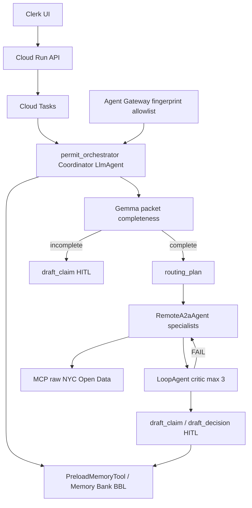

# Permit Pilot

**NYC building-permit clerk orchestration** on the Gemini Enterprise Agent Platform. A coordinator writes a routing plan, delegates to department specialists over A2A, and pauses for a human clerk. Agents never approve a permit and never notify the applicant.

Built for the [All Things Agentic Hackathon](https://allthingsagentichackathon.devpost.com/) — **Fortified Enterprise Fleet** track.

Maria is a Queens plan examiner. Fifty packets a week, seven agencies, no single inbox. Permit Pilot is the clerk layer **above DOB NOW** — it does not replace it.

| Live service | URL |
|--------------|-----|
| Clerk app (UI + `/api`) | https://permit-pilot-pbrfw2zkaq-uc.a.run.app |
| Permit Tools MCP | https://permit-pilot-mcp-pbrfw2zkaq-uc.a.run.app/mcp (authenticated) |

**GCP project:** `gen-lang-client-0233250350` · **Region:** `us-central1` · **Model:** `gemini-3.5-flash` at `VERTEX_LOCATION=global`

---

## Architecture



Hot path: intake, refresh, fleet run, and Eventarc claim resume all **enqueue Cloud Tasks**. The worker calls `run_distribution`, which scans completeness, persists a routing plan, then `stream_query` on the orchestrator. If A2A is down, selected department engines run in parallel. Last resort is `DistributionEngine` labeled `generated_by=engine_fallback`.

MCP `lookup_*` tools return raw Socrata rows and counts. They do **not** decide PASS/FAIL. `persist_review` is the only verdict write. The critic retrieves ordinance text via `get_ordinance_section` (BetaNYC-shaped corpus).

---

## What Maria sees

1. **My Tasks** — daily inbox with a 5-day review clock
2. **Case file** — Summary, Distribution (routing plan + completeness pause + crash/resume), Documents, Claims, Audit
3. **Fleet** — eight Agent Runtime engines with SPIFFE identities; **Test gateway** vs **Send tampered request**
4. **Governance** — Agent Gateway, Model Armor inspect
5. **Parcel memory** — Memory Bank facts keyed to a BBL
6. **HITL** — agents draft claims and decisions; Maria confirms before anything is sent or recorded

Reference BBLs in `packages/permit_pilot_core/permit_pilot_core/seeds.py`:

| Address | BBL | Notes |
|---------|-----|--------|
| 43-30 Parsons Boulevard, Queens | `4051980021` | Demolition; building FAIL on active DOB violations |
| 112-08 178 Street, Queens | `4103000034` | Often missing BIN — completeness checklist, not objections |
| 761 Macon Street, Brooklyn | `3014930048` | Plumbing, PLUTO **R5B**, empty `histdist` — skip LPC |

---

## Platform facts

| Capability | Implementation |
|------------|----------------|
| Intelligent delegation | Coordinator writes a visible routing plan; plumbing + empty `histdist` skips LPC |
| A2A fleet | `RemoteA2aAgent` specialists on Agent Runtime; in-process specialists if cards fail |
| Completeness | Gemma 3 packet scan + identifier gate; incomplete → checklist claim, no Fire/HPD |
| Critic loop | `LoopAgent` max 3; FAIL re-routes to the named department; ordinance `get_section` |
| HITL | `draft_claim` / `draft_decision` pause until Maria confirms |
| Identity | Agent Runtime `AGENT_IDENTITY` — SPIFFE `agents.global.proj-{NUM}.system.id.goog` |
| Egress | Agent Gateway `permit-pilot-egress`; invoke fingerprint allowlist (HMAC, not admin role) |
| Tools | Permit Tools MCP; zoning cannot call HPD |
| Guardrails | Model Armor `permit-pilot-armor` |
| Async | Cloud Tasks `permit-pilot-distribution` + Eventarc on Firestore claims |
| Memory | Memory Bank scoped `{"bbl": "..."}`; `PreloadMemoryTool` on the coordinator |
| Observability | OpenTelemetry → Cloud Trace; in-app Traces; Vertex Agent Observability for A2A hops |

---

## Repo layout

```
permit-pilot/
  packages/permit_pilot_core/   # models, evidence, routing, critic, fleet_runner, settings
  services/api/                 # FastAPI control plane
  services/mcp-tools/           # Raw NYC Open Data + ordinance MCP server
  services/orchestrator/        # 8 ADK agents (coordinator + specialists)
  web/                          # React 19 + Vite + Tailwind 4
  scripts/
    deploy.sh                   # Combined UI + API Cloud Run
    deploy-fleet.py             # Agent Runtime fleet
    bind-agent-gateway.py       # Rebind engines to the gateway
    bind-agent-identity.sh      # IAP least-privilege CEL
    audit.sh                    # Production proof
    eval.sh                     # Golden BBL / tool-trajectory eval
    provision-platform.sh       # Gateway, IAP, Eventarc (do not re-run casually)
```

---

## Quick start (local)

**Prerequisites:** Node 22+, Python 3.12+, [gcloud CLI](https://cloud.google.com/sdk/docs/install) with Application Default Credentials.

```bash
gcloud config set project gen-lang-client-0233250350
gcloud auth application-default login

export GOOGLE_CLOUD_PROJECT=gen-lang-client-0233250350
export VERTEX_LOCATION=global
export VERTEX_MODEL=gemini-3.5-flash

./scripts/dev.sh api
./scripts/dev.sh web
```

`.cloud-deploy.env` is gitignored. Clerk password lives in Secret Manager `permit-pilot-clerk-password`. Bootstrap clerk is `maria`.

---

## Deploy

```bash
set -a && source .cloud-deploy.env && set +a
export VERTEX_LOCATION=global VERTEX_MODEL=gemini-3.5-flash
./scripts/deploy.sh
.venv/bin/python scripts/deploy-fleet.py   # or DEPLOY_ONLY=permit_orchestrator
python3 scripts/bind-agent-gateway.py
PERMIT_PILOT_URL="$(gcloud run services describe permit-pilot --region=us-central1 --format='value(status.url)')" \
  ./scripts/audit.sh
```

---

## API highlights

All routes are under `/api`:

| Route | Purpose |
|-------|---------|
| `POST /cases/intake` | New case; enqueue Cloud Tasks fleet |
| `GET /cases/{id}/bundle` | Case + routing plan + completeness + HITL + traces |
| `POST /cases/{id}/fleet/run` | Enqueue coordinator distribution |
| `POST /cases/{id}/distribution/refresh` | Same enqueue (live NYC Open Data) |
| `POST /cases/{id}/distribution/interrupt` | Authenticated crash flag (checked before each A2A hop) |
| `POST /cases/{id}/distribution/resume` | Clear flag; skip completed specialists |
| `POST /cases/{id}/hitl/confirm` | Clerk confirms a drafted claim or decision |
| `POST /cases/{id}/orchestrate` | Briefing from persisted reviews (orchestrator, Vertex fallback) |
| `GET /agents` | Fleet cards with SPIFFE + invoke fingerprint |
| `POST /agents/{name}/invoke` | Signed fingerprint → Agent Runtime; tampered → 403 allowlist |
| `GET /governance` | Gateway, Armor, registry, console links |
| `GET /memory/{bbl}` | Memory Bank retrieve by parcel |
| `POST /api/internal/distribution/run` | Cloud Tasks worker (OIDC) |
| `POST /api/internal/eventarc/claims` | Eventarc claim resume + Memory Bank fact |

---

## Demo beats (4-minute live video)

| t | Beat |
|---|---|
| 0:00–0:20 | Maria + live Cloud Run `.run.app` |
| 0:20–0:45 | Fleet: signed A2A pass, tampered fingerprint 403 |
| 0:45–1:15 | Intake with SSN → redacted + Gemma incomplete (no BIN) → checklist drafted, departments not started |
| 1:15–1:35 | Complete packet → **routing plan** visible (Macon plumbing skips LPC) |
| 1:35–2:20 | Parallel department chips; Simulate crash; Resume skips completed |
| 2:20–2:50 | Critic FAIL → department re-run with citation (loop) |
| 2:50–3:20 | HITL approve; Memory Bank fact on BBL; Observability A2A hops |
| 3:20–3:50 | Next task; Eventarc “weeks later” claim resume |
| 3:50–4:00 | GEAP one-liner: coordinator + A2A + Memory Bank + Gateway |

---

## Evaluation

```bash
./scripts/eval.sh
```

Golden set: Macon Street (`3014930048`) PLUTO **R5B** and skip LPC. Parsons building tool trajectory includes `lookup_dob_violations` then `persist_review`. 178 Street routing includes landmarks when complete. Critic FAILs uncited failures and evidence/status contradictions. Eval set: `packages/permit_pilot_core/eval/permit_pilot.evalset.json`.

---

## License

Hackathon submission — see repository owner for terms.
