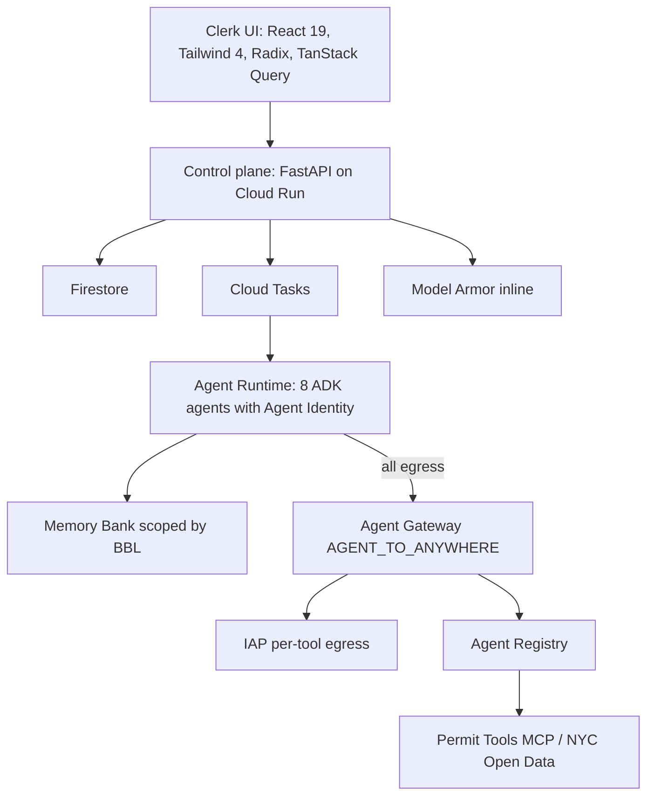

# Permit Pilot

**NYC building-permit clerk orchestration** on the Gemini Enterprise Agent Platform. Department agents review live NYC Open Data through a governed MCP server; a human clerk decides.

Built for the [All Things Agentic Hackathon](https://allthingsagentichackathon.devpost.com/) — **Fortified Enterprise Fleet** track.

| Live service | URL |
|--------------|-----|
| Clerk app (UI + `/api`) | https://permit-pilot-pbrfw2zkaq-uc.a.run.app |
| Permit Tools MCP | https://permit-pilot-mcp-pbrfw2zkaq-uc.a.run.app/mcp (authenticated) |

**GCP project:** `gen-lang-client-0233250350` · **Region:** `us-central1` · **Model:** `gemini-3.5-flash` at `VERTEX_LOCATION=global`

---

## Architecture



The control plane does not run department agents inline. Intake, refresh, claim resume, and “Run fleet” enqueue Cloud Tasks. Eventarc wakes a case when an applicant claim is updated weeks later.

---

## What it does

Maria (NYC plan examiner) uses the clerk UI:

1. **My Tasks** — daily inbox with a 5-day review clock
2. **Case file** — Summary, Distribution, Documents, Claims, Audit
3. **Department fleet** — Zoning, Building, Fire, Utilities, Landmarks, Housing, Critic, Orchestrator
4. **Governance** — Agent Gateway, Model Armor inspect, SPIFFE identities
5. **Parcel memory** — Memory Bank facts keyed to a BBL
6. **Clerk decides** — Approve or request changes with a required audit note

Reference BBLs live in `packages/permit_pilot_core/permit_pilot_core/seeds.py` (761 Macon Street is `3014930048`, PLUTO zone **R5B**, dataset `64uk-42ks`).

---

## Platform facts

| Capability | Implementation |
|------------|----------------|
| Identity | Agent Runtime `identity_type=AGENT_IDENTITY` — SPIFFE trust domain `agents.global.proj-{NUM}.system.id.goog` |
| Egress | Agent Gateway `permit-pilot-egress` in `AGENT_TO_ANYWHERE` mode |
| Least privilege | IAP `roles/iap.egressor` per agent; zoning cannot call HPD |
| Guardrails | Model Armor template `permit-pilot-armor` (inline + gateway extension) |
| Tools | Permit Tools MCP on Cloud Run, registered in Agent Registry |
| Async | Cloud Tasks queue `permit-pilot-distribution` + Eventarc on Firestore claims |
| Memory | Memory Bank scoped `{"bbl": "..."}` |
| Observability | OpenTelemetry → Cloud Trace; in-app run history on Traces; Vertex Agent Observability for LLM/tool DAG |

---

## Repo layout

```
permit-pilot/
  packages/permit_pilot_core/   # models, Socrata, Firestore, MCP-backed distribution, settings
  services/api/                 # FastAPI control plane
  services/mcp-tools/           # Governed NYC Open Data MCP server
  services/orchestrator/        # 8 ADK agents
  web/                          # React 19 + Vite + Tailwind 4
  scripts/
    deploy.sh                   # Combined UI + API Cloud Run
    deploy-fleet.py             # Agent Runtime fleet
    bind-agent-gateway.py       # Rebind engines to the gateway
    bind-agent-identity.sh      # IAP least-privilege CEL
    audit.sh                    # Production proof (gateway, Armor, memory, resume)
    provision-platform.sh       # Gateway, IAP, Eventarc (do not re-run casually)
```

---

## Quick start (local)

**Prerequisites:** Node 22+, Python 3.12+, [gcloud CLI](https://cloud.google.com/sdk/docs/install) with Application Default Credentials.

```bash
gcloud config set project gen-lang-client-0233250350
gcloud auth application-default login

export GOOGLE_CLOUD_PROJECT=gen-lang-client-0233250350
export VERTEX_LOCATION=global
export VERTEX_MODEL=gemini-3.5-flash

./scripts/dev.sh api
./scripts/dev.sh web
```

`.cloud-deploy.env` is gitignored. Clerk password lives in Secret Manager `permit-pilot-clerk-password`.

---

## Deploy

```bash
set -a && source .cloud-deploy.env && set +a
export VERTEX_LOCATION=global VERTEX_MODEL=gemini-3.5-flash
./scripts/deploy.sh
python3 scripts/deploy-fleet.py
python3 scripts/bind-agent-gateway.py
PERMIT_PILOT_URL="$(gcloud run services describe permit-pilot --region=us-central1 --format='value(status.url)')" \
  ./scripts/audit.sh
```

---

## API highlights

All routes are under `/api`:

| Route | Purpose |
|-------|---------|
| `POST /cases/intake` | New case; enqueue Cloud Tasks fleet |
| `GET /cases/{id}/bundle` | Case + distribution + claims + audit + traces |
| `POST /cases/{id}/fleet/run` | Enqueue Agent Runtime distribution |
| `POST /cases/{id}/distribution/refresh` | Enqueue a live NYC Open Data refresh |
| `POST /cases/{id}/orchestrate` | Vertex Gemini clerk briefing |
| `GET /agents` | Fleet cards with SPIFFE IDs |
| `GET /governance` | Gateway, Armor, registry, console links |
| `GET /memory/{bbl}` | Memory Bank retrieve by parcel |
| `POST /armor/inspect` | Model Armor on clerk-supplied text |
| `POST /api/internal/distribution/run` | Cloud Tasks worker (OIDC) |
| `POST /api/internal/eventarc/claims` | Eventarc claim resume |

---

## Demo beats (repeatable)

1. Sign in as Maria. Open **Fleet** — eight engines with SPIFFE `proj-` principals.
2. **Governance** — paste a jailbreak; Model Armor returns **Blocked**.
3. **Parcel memory** — BBL `3014930048` retrieves Memory Bank facts.
4. Intake or **Run Agent Runtime fleet** on a case — Cloud Tasks 200, distribution fills from NYC Open Data.
5. Open a department row — evidence cites live dataset IDs (`64uk-42ks`, `skr7-cxt3`, …).
6. **Traces** — in-app run history with nested department spans; open Agent Observability for orchestrator LLM/tool DAG.
7. Optional: revoke zoning’s IAP binding and re-run fleet — `lookup_pluto` is denied at the gateway.

---

## Evaluation

```bash
cd packages/permit_pilot_core
python -m unittest tests.test_eval_bbls tests.test_parcel tests.test_identity tests.test_fleet_catalog
```

Golden set: 761 Macon Street (`3014930048`) must resolve PLUTO zone **R5B**. Critic must FAIL an uncited department failure.

---

## License

Hackathon submission — see repository owner for terms.
